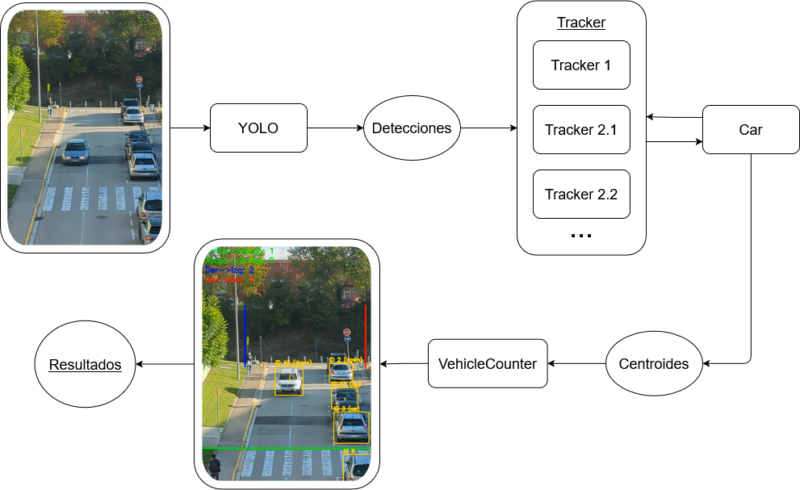
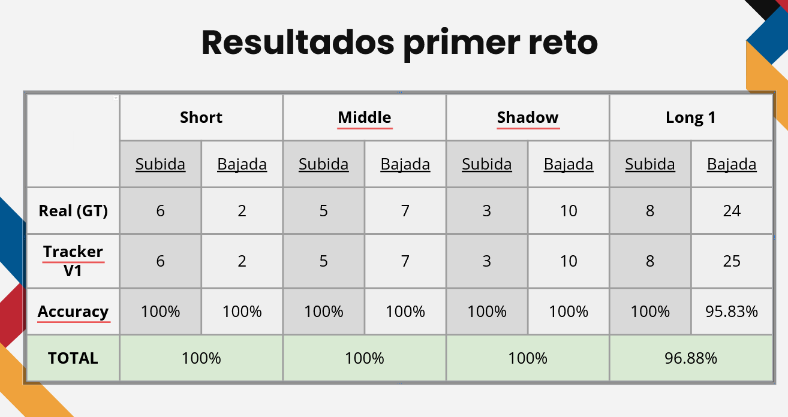
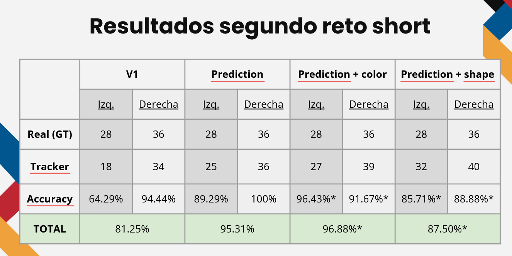
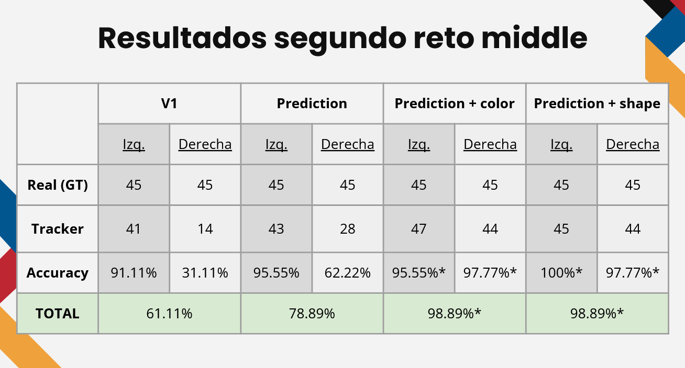

# Psiv2-Tracking

Reto de seguimiento de coches en vídeo usando YOLOv11n y técnicas de tracking.

## Descripción
Proyecto para detectar, seguir y contar vehículos en vídeos usando modelos YOLOv11 (`weights/`) y un módulo de tracking propio (`tracker.py`). Incluye utilidades para procesar frames y generar vídeos de salida en `runs/`.

## Requisitos
- Python 3.10 - 3.12 (recomendado)
- GPU opcional (recomendado para velocidad)
- Archivos principales:
  - `main.py`
  - `detection_frames.py`
  - `tracker.py`
  - `VehicleCounter.py`
  - `utilities.py`
  - pesos en `weights/` (ej. `yolo11n.pt`, `yolo11s.pt`)

## Instalación (Windows - cmd.exe)

##### Opción A — entorno virtual + pip:
1. Crear y activar venv:
python -m venv .venv .venv\Scripts\activate
2. Actualizar pip(Opcional, es buena costumbre):
python -m pip install --upgrade pip
3. Instalar resto de dependencias:
pip install -r requirements.txt
Si te da un error con torch, es posible que tengas que instalar torch manualmente.

##### Opción B — conda:
1. Crear entorno conda:
conda env create -f environment.yml
2. Activar entorno:
conda activate psiv2-tracking

Si algo falla, con el env creado haz pip install -r requirements.txt

## Cómo probar el contador de vehiculos

1. Asegurate de tener al menos un vídeo en la carpeta `videos/` para probar el código. Y adaptar el path en `main.py` si es necesario.
2. Ejecutar el script `main.py` con Python. Asegurarse de tener instaladas las dependencias necesarias (OpenCV, NumPy, etc.).
3. Resultados y vídeos procesados se guardan en `runs/cars_video/`. Igualmente en vivo puedes ver el seguimiento y conteo en una ventana emergente.

## Estructura del proyecto
- `main.py` — script principal.
- `detection_frames.py` — procesamiento por frame y llamadas al tracker.
- `tracker.py` — clases de tracking y lógica de asociación.
- `car.py` — clase para representar vehículos y guardar su información.
- `VehicleCounter.py` — lógica de conteo.
- `utilities.py` — funciones auxiliares.
- `weights/` — modelos YOLO.
- `videos/` — vídeos de entrada.
- `runs/cars_video/` — salidas generadas.

## Pipeline del proyecto

## Descripcion de la detección
La detección de vehículos se realiza utilizando el modelo YOLOv11n preentrenado, que es capaz de identificar múltiples clases de objetos en imágenes y vídeos.
Utilizamos yolo cada x frames (2,3 o 4 en diferentes fases del proyecto) para detectar los vehículos en el vídeo. El modelo devuelve bounding boxes (cajas delimitadoras) alrededor de los vehículos detectados, junto con una puntuación de confianza que indica la probabilidad de que la detección sea correcta.
Usamos un treshold para filtrar las detecciones con baja confianza y quedarnos solo con las más fiables.

## Descripción del tracking
Después de obtener las detecciones de vehículos en cada frame, el siguiente paso es realizar el seguimiento (tracking) de estos vehículos a lo largo del vídeo.
Utilizamos las bonding boxes detectadas para asociar detecciones en frames consecutivos. El objetivo es asignar un identificador único a cada vehículo para poder seguir su movimiento a lo largo del tiempo.
La clase car y la clase tracker se encargan de gestionar esta información. La clase car almacena la información de cada vehículo, incluyendo su bounding box actual, su identificador único y su historial de posiciones.
La clase tracker es responsable de recibir las detecciones de cada frame y actualizar la información de los vehículos existentes o crear nuevos vehículos si se detectan nuevos objetos.

## Tipos de trackers
Usamos diferentes trackers. Destacamos dos por sus buenos resultados:
El class Tracker, que es el tracker padre de el resto y el mas sencillo.

El class Tracker_prediction, que usa predicción de movimiento para mejorar el tracking en situaciones donde los vehículos se mueven rápidamente o hay oclusiones.

Además, se implementó un tracker híbrido que combina múltiples métricas (IoU, distancia entre centros, predicción de movimiento) para mejorar la precisión del seguimiento. Pero termino
siendo peor que el tracker con predicción de movimiento solo.

## Resultados
Resultados del conteo direcciones arriba-abajo

Resultados del conteo direcciones izquierda-derecha

## Autores
- Adrían Díaz : https://github.com/adriidz
- Miquel González : https://github.com/Miquel44
- Cristian Rey : https://github.com/Crisis3012